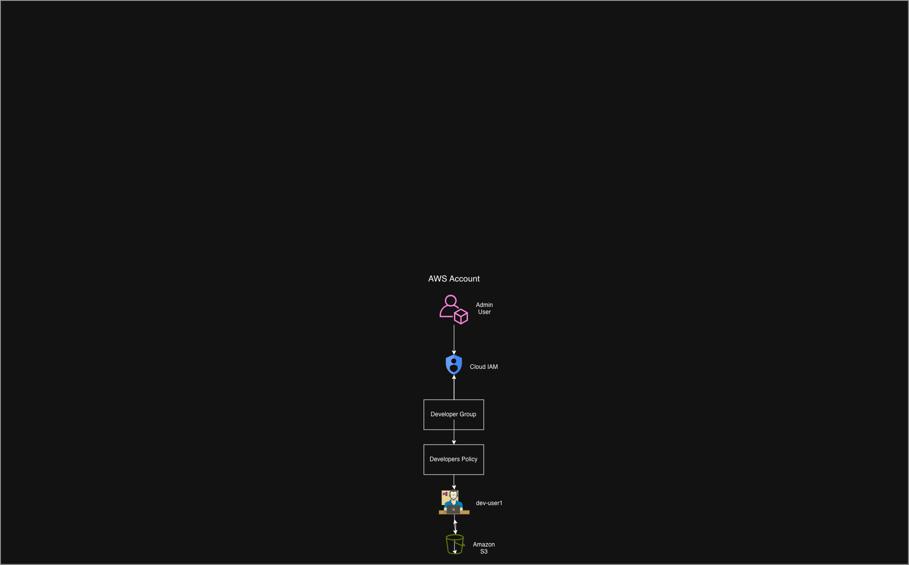
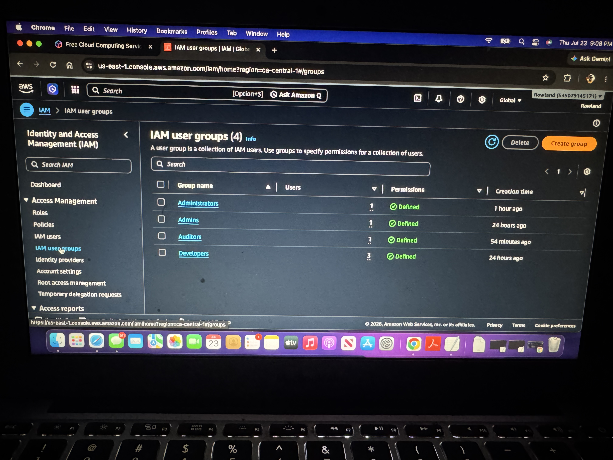
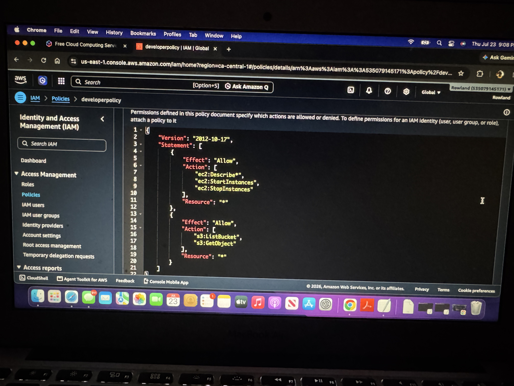
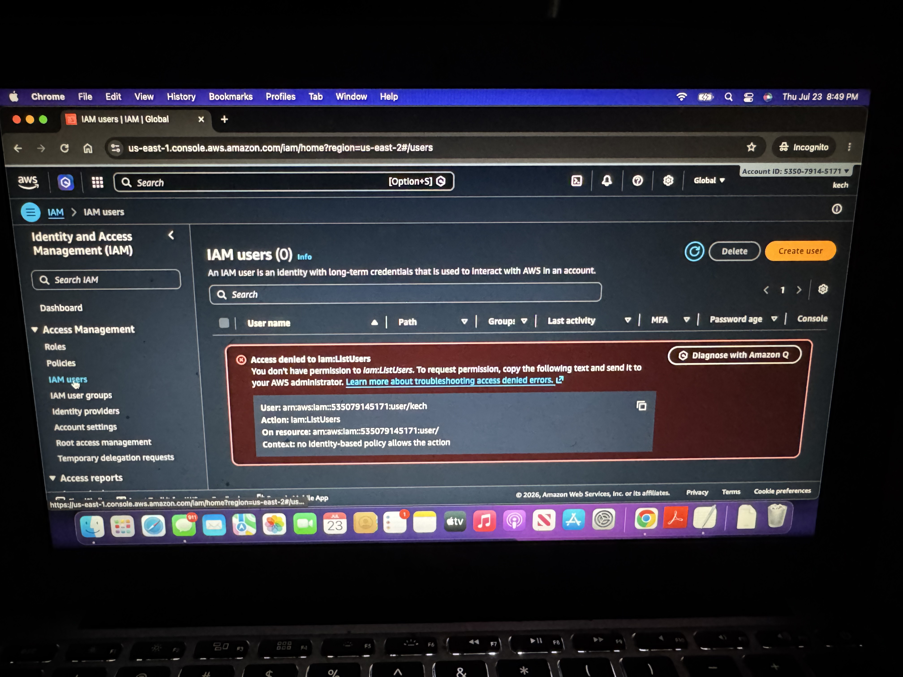
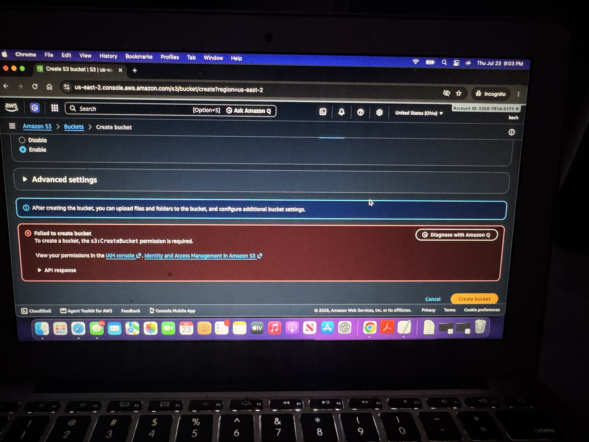

</> Markdown

# AWS IAM Security Lab

## Project Overview

This project demonstrates AWS Identity and Access Management (IAM) security best practices by creating users, groups, policies, and roles following the principle of least privilege.

## AWS Services Used

- AWS IAM
  
- Amazon S3

## Architecture



## Implementation

## Project Objectives

- Create IAM users
- Create IAM groups
- Create a custom IAM policy
- Assign users to groups
- Test user permissions
- Apply the principle of least privilege

---

## Project Scenario

A company wants developers to access only a specific Amazon S3 bucket. Rather than granting AdministratorAccess, a custom IAM policy is created and attached to the Developers group. Any user added to the group automatically receives the required permissions.

---

# Step 1 – Create the Developers Group

1. Sign in to the AWS Management Console.
2. Search for **IAM**.
3. In the left menu, select **User groups**.
4. Click **Create group**.
5. Enter the group name:

   `Developers`

6. Leave the permissions section empty for now.
7. Click **Create group**.



---

# Step 2 – Create IAM Users

1. In IAM, select **Users** from the left menu.
2. Click **Create user**.
3. Enter the username:

   `Dev-User1`

4. Enable AWS Management Console access if you want to test through the console.
5. Set the password options.
6. Add the user to the **Developers** group.
7. Complete the user creation process.
8. Repeat the same steps for:

   `Dev-User2`
---

# Step 3 – Create a Custom IAM Policy

A custom IAM policy named **DeveloperPolicy** was created to grant developers only the permissions required for their role.

The policy allows:
- View EC2 instances
- Start EC2 instances
- Stop EC2 instances
- List Amazon S3 buckets
- Read objects from Amazon S3

Steps
1. In the AWS Management Console, Open IAM.
2. From the left navigation pane, click Policies.
3. Click Create Policy.
4. Select the JSON tab
5. Paste your custom IAM policy:
   ## Policy JSON

```json
{
  "Version": "2012-10-17",
  "Statement": [
    {
      "Effect": "Allow",
      "Action": [
        "ec2:Describe*",
        "ec2:StartInstances",
        "ec2:StopInstances"
      ],
      "Resource": "*"
    },
    {
      "Effect": "Allow",
      "Action": [
        "s3:ListBucket",
        "s3:GetObject"
      ],
      "Resource": "*"
    }
  ]
}
```
7. Click Next.
8. Name the Policy "DeveloperPolicy"
9. Add a description
10. Click Create Policy



---

# Step 4 – Attach the Policy to the Developers Group

The custom policy was attached to the Developers group instead of individual users. This follows AWS best practices by managing permissions through groups.

Steps
1. In IAM, click User groups.
2. Select the Developers group.
3. Open the Permissions tab.
4. Click Add permissions.
5. Choose Attach policies.
6. Search for: DeveloperPolicy

 7. Select the policy.
 8. Click Add permissions.
Expected Result
The Developers group now inherits the permissions defined in the custom policy. Any user added to the group automatically receives these permissions.

---

# Step 5 – Test User Permissions

Logged in as **Dev-User1** and verified that the custom IAM policy correctly enforced least-privilege access.

The following tests were performed:

- Attempting to list IAM users resulted in **Access Denied**.
- Attempting to create an Amazon S3 bucket also resulted in **Access Denied** because the policy did not grant that permission.

### Access Denied when listing IAM users



### Access Denied when creating an S3 bucket



Steps
1. Sign out of the AWS Management Console.
2. Sign in as Dev-User1 using the IAM User Sign-In URL.
3. Open the IAM service.
4. Attempt to view all IAM users.
5. Verify that Access Denied is displayed.
6. Open Amazon S3.
7. Attempt to create a new bucket.
8. Verify that Access Denied is displayed.
9. Confirm that the user can only perform the actions granted by the custom IAM policy.

# Results

✅ Successfully created IAM users and groups.

✅ Successfully created and attached a custom IAM policy.

✅ Successfully verified least-privilege access using an IAM user.

---

# Skills Demonstrated

- AWS IAM
- Identity and Access Management
- IAM Policies
- IAM Groups
- Principle of Least Privilege
- Amazon S3 Permissions
- AWS Security Best Practices

---

# Lessons Learned

This project reinforced AWS IAM best practices, including managing permissions through groups, creating custom IAM policies, and applying the Principle of Least Privilege to improve cloud security.
